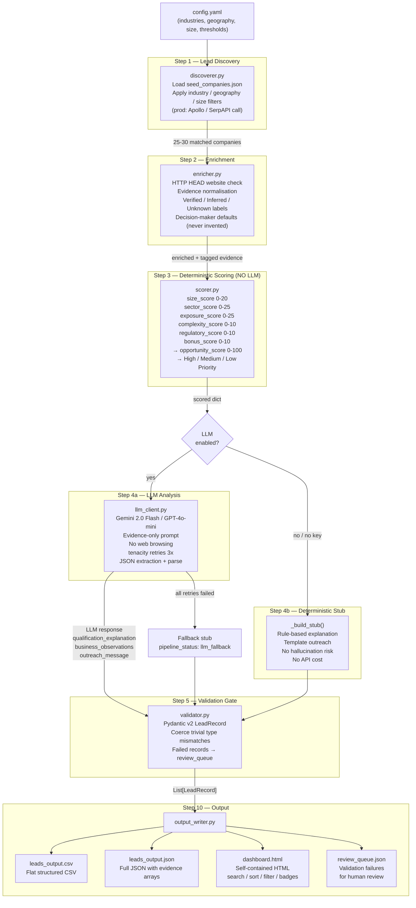

```mermaid
flowchart TD
    A["config.yaml\n(industries, geography, size, thresholds)"]

    A --> B

    subgraph S1["Step 1 — Lead Discovery"]
        B["discoverer.py\nLoad seed_companies.json\nApply industry / geography / size filters\n(prod: Apollo / SerpAPI call)"]
    end

    B -->|"25-30 matched companies"| C

    subgraph S2["Step 2 — Enrichment"]
        C["enricher.py\nHTTP HEAD website check\nEvidence normalisation\nVerified / Inferred / Unknown labels\nDecision-maker defaults (never invented)"]
    end

    C -->|"enriched + tagged evidence"| D

    subgraph S3["Step 3 — Deterministic Scoring (NO LLM)"]
        D["scorer.py\nsize_score 0-20\nsector_score 0-25\nexposure_score 0-25\ncomplexity_score 0-10\nregulatory_score 0-10\nbonus_score 0-10\n→ opportunity_score 0-100\n→ High / Medium / Low Priority"]
    end

    D -->|"scored dict"| E{LLM\nenabled?}

    subgraph S4a["Step 4a — LLM Analysis"]
        F["llm_client.py\nGemini 2.0 Flash / GPT-4o-mini\nEvidence-only prompt\nNo web browsing\ntenacity retries 3x\nJSON extraction + parse"]
    end

    subgraph S4b["Step 4b — Deterministic Stub"]
        G["_build_stub()\nRule-based explanation\nTemplate outreach\nNo hallucination risk\nNo API cost"]
    end

    E -->|"yes"| F
    E -->|"no / no key"| G
    F -->|"LLM response\nqualification_explanation\nbusiness_observations\noutreach_message"| H
    G --> H

    F -->|"all retries failed"| G2["Fallback stub\npipeline_status: llm_fallback"]
    G2 --> H

    subgraph S5["Step 5 — Validation Gate"]
        H["validator.py\nPydantic v2 LeadRecord\nCoerce trivial type mismatches\nFailed records → review_queue"]
    end

    H -->|"List[LeadRecord]"| I

    subgraph S10["Step 10 — Output"]
        I["output_writer.py"]
        I --> J["leads_output.csv\nFlat structured CSV"]
        I --> K["leads_output.json\nFull JSON with evidence arrays"]
        I --> L["dashboard.html\nSelf-contained HTML\nsearch / sort / filter / badges"]
        I --> M["review_queue.json\nValidation failures\nfor human review"]
    end
```
